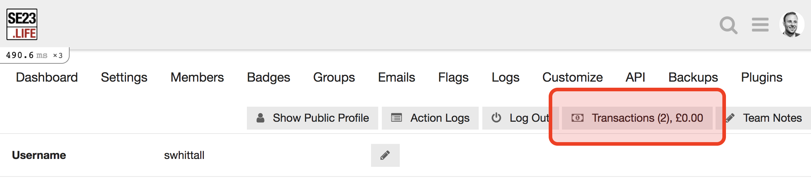
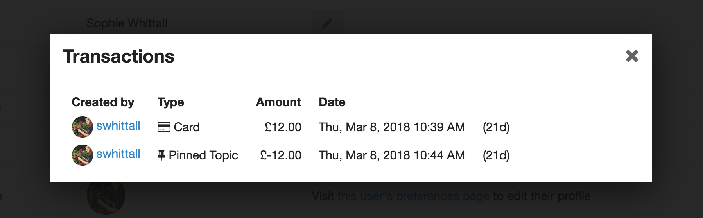
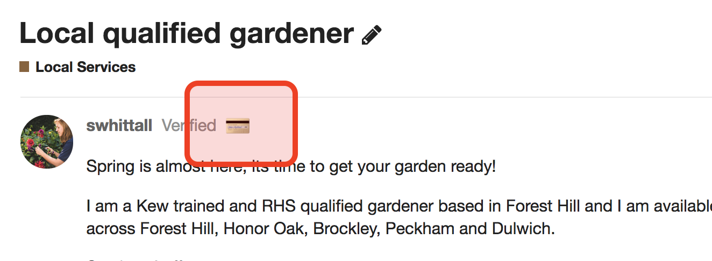

# Discourse Paid Pinning Plugin

[](https://travis-ci.org/chrisbeach/discourse-paid-pinning)

* "Advertise" page (accessible via top menu and hamburger menu) 
allows users to make payment using Stripe Checkout
* After making a payment, users are able to create a pinned topic


## Admin Features

* Admins can view transactions by clicking the "Transactions" button on user admin pages





* Users with transactions are displayed with a credit card icon:




## Installation

1. Install plugin. [Instructions here](https://meta.discourse.org/t/install-a-plugin/19157). Clone URL: https://github.com/chrisbeach/discourse-paid-pinning.git
1. Create an account at [Stripe.com](https://stripe.com). On the dashboard page you'll find the necessary API keys in the "API" section
1. On your Discourse instance: **Admin** > **Plugins** > discourse-paid-pinning **Settings**
    1. Enter your Stripe key (public and secret)
    1. Tweak other settings as necessary
    1. Click to "Enable paid pinning plugin"


## Using the Rails Console to Manually Add or Remove Transactions

It may be necessary to perform one-off admin operations on user transactions.
 
Use the rails console.

To start the console, open a terminal and cd to your discourse directory (usually `/var/discourse`):

```bash
./launcher enter app
rails c
```

#### Remove all transactions for a user:

Example:

```ruby
Txns.remove_all_txns([user_id])
```
(substitute the relevant user id)

#### Add a transaction to user:

`add_txn(user, amount, created_by, type, topic_id = nil, note = "")`

Example:

```ruby
Txns.add_txn(User.where(id: 2).first, 10000, 1, 3, nil, "a free gift")
```


## Reference

* Stripe Checkout Reference: https://stripe.com/docs/checkout/tutorial

## Author
Chris Beach <chris @ chrisbeach . co . uk>

## License (Apache 2.0)

NOTE: This plugin is not supported or officially endorsed by Stripe (https://stripe.com)

